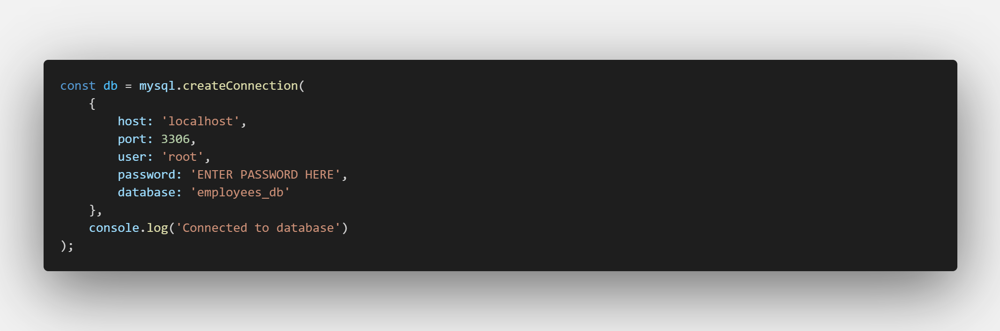

# 12 SQL: Employee Tracker

## Github Repo Link

[Link to GitHub Repo] (https://github.com/MiinoSil/12-SQL-EMPLOYEE-TRKR-HWK-GIT)

## Description

This is a command-line application built using Node.js, inquirer, and MySql. It is an employee database for a company allowing a user to browse the different departments of a company, the roles, and the employees. 

## Your Task

Developers frequently have to create interfaces that allow non-developers to easily view and interact with information stored in databases. These interfaces are called **content management systems (CMS)**. Your assignment this week is to build a command-line application from scratch to manage a company's employee database, using Node.js, Inquirer, and MySQL.

Because this application won’t be deployed, you’ll also need to create a walkthrough video that demonstrates its functionality and all of the following acceptance criteria being met. You’ll need to submit a link to the video and add it to the README of your project.

## User Story

```md
AS A business owner
I WANT to be able to view and manage the departments, roles, and employees in my company
SO THAT I can organize and plan my business
```

## NPM requirements to install
```
inquirer

mysql2

console.table
```

## Usage
REMINDER: need to add login credentials to database connection:


```
npm install
```
Should install all required NPM per package.json.

If needed to put in a sample database, run the following in mysql terminal:
```
SOURCE db\schema.sql

SOURCE db\seeds.sql
```

Then in terminal
```
node index.js
```
## Video Walkthrough (Per current WIP of app, not the mock up version)


[Link to original video on Screencastify](https://drive.google.com/file/d/1j_L-JIOnpFR3Xd-h7DggqeGt5KpNed2J/view)

## Acceptance Criteria

```md
GIVEN a command-line application that accepts user input
WHEN I start the application
THEN I am presented with the following options: view all departments, view all roles, view all employees, add a department, add a role, add an employee, and update an employee role
WHEN I choose to view all departments
THEN I am presented with a formatted table showing department names and department ids
WHEN I choose to view all roles
THEN I am presented with the job title, role id, the department that role belongs to, and the salary for that role
WHEN I choose to view all employees
THEN I am presented with a formatted table showing employee data, including employee ids, first names, last names, job titles, departments, salaries, and managers that the employees report to
WHEN I choose to add a department
THEN I am prompted to enter the name of the department and that department is added to the database
WHEN I choose to add a role
THEN I am prompted to enter the name, salary, and department for the role and that role is added to the database
WHEN I choose to add an employee
THEN I am prompted to enter the employee’s first name, last name, role, and manager, and that employee is added to the database
WHEN I choose to update an employee role
THEN I am prompted to select an employee to update and their new role and this information is updated in the database 
```

## Mock-Up Example, Goal to build toward.

The following video shows an example of the application being used from the command line:

[](https://2u-20.wistia.com/medias/2lnle7xnpk)


Design the database schema as shown in the following image:


As the image illustrates, your schema should contain the following three tables:

* `department`

    * `id`: `INT PRIMARY KEY`

    * `name`: `VARCHAR(30)` to hold department name

* `role`

    * `id`: `INT PRIMARY KEY`

    * `title`: `VARCHAR(30)` to hold role title

    * `salary`: `DECIMAL` to hold role salary

    * `department_id`: `INT` to hold reference to department role belongs to

* `employee`

    * `id`: `INT PRIMARY KEY`

    * `first_name`: `VARCHAR(30)` to hold employee first name

    * `last_name`: `VARCHAR(30)` to hold employee last name

    * `role_id`: `INT` to hold reference to employee role

    * `manager_id`: `INT` to hold reference to another employee that is the manager of the current employee (`null` if the employee has no manager)
